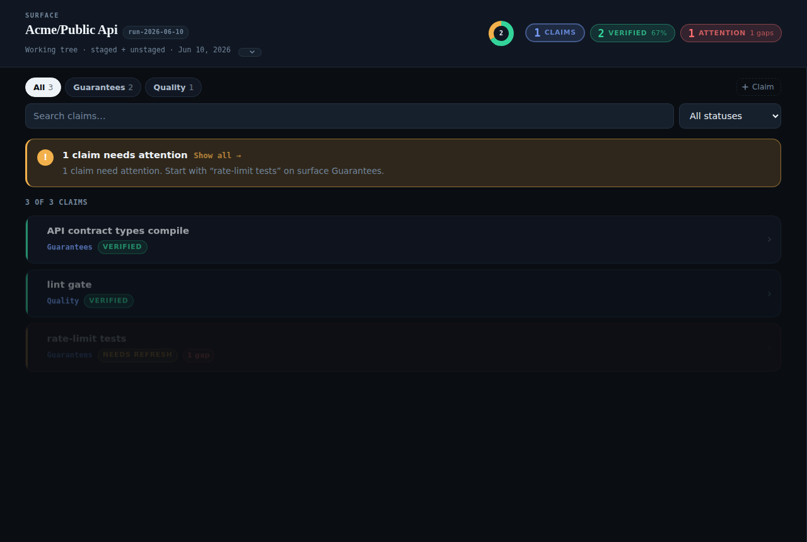
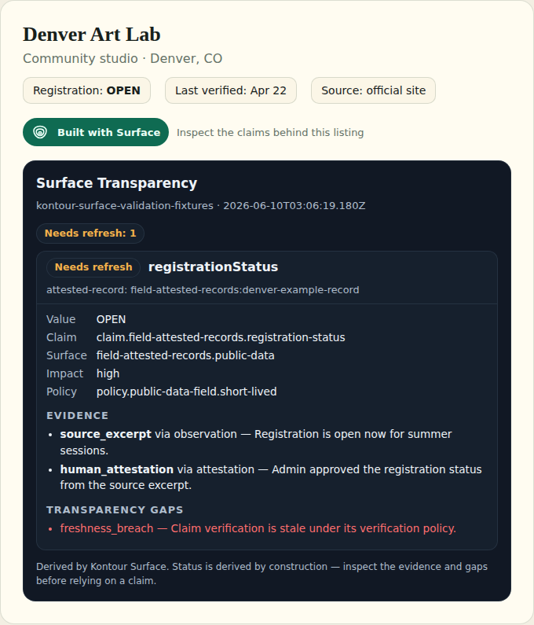

# Kontour Surface

**Show your work. Earn trust.**

[](https://www.npmjs.com/package/@kontourai/surface)
[](https://github.com/kontourai/surface/actions/workflows/ci.yml)
[](LICENSE)

Surface is the shared transparency foundation for Kontour products and any product that needs to show its work. It connects evidence provenance to claims, derives portable trust state — verified, stale, disputed, missing — and makes that state inspectable through reports, a local console, APIs, and agent-readable resources. See [Vision](docs/product/vision.md) for the fuller narrative.

## Who builds with it

- **AI code governance** — [Veritas](https://kontourai.io/veritas) authors claims about repo areas, collects evidence per run, and lets reviewers (and agents) see exactly which claims this run's evidence supports — and which went stale when the code changed.
- **Field-attested public records** — a data directory maps crawled fields and human attestations into per-field claims, so "verified" means *this field, this source, this date* instead of a badge on the whole record.
- **Fact resolution** — a financial workflow keeps user-verified facts and document-imported values in the same report, with conflicts visibly disputed instead of averaged into a confidence score.
- **Dependency audits** — `npm audit` output becomes evidence behind a "safe to install" claim with a freshness window and a trace to the exact run.
- **Agent guardrails** — agents query stale claims, missing evidence, and policy gaps through the CLI, the JSON report, or the built-in [MCP server](docs/reference/mcp.md), and apply the discipline the kernel derives: act on verified, reverify stale, escalate disputed.

Each of these ships as a runnable example in [`examples/`](docs/reference/examples.md). The deeper narratives are in [Use Cases](docs/product/use-cases.md).

## What Surface is not

Surface is not a promise of perfect truth, a certification business, a hosted-only
evidence collector, or the owner of the underlying open format. Producers collect
domain evidence and make domain decisions. [Hachure](https://github.com/hachure-org/spec)
owns the normative schemas and derivation semantics; Surface is Kontour's
integration layer and reference implementation for constructing, validating,
deriving, and presenting that portable trust state. If a claim is weak, stale,
or disputed, Surface makes that obvious instead of papering over it.

## Where Surface fits

Kontour AI shows the work behind AI. Surface is the foundation the rest of the family builds on:

| Product | Owns |
| --- | --- |
| **[Hachure](https://github.com/hachure-org/spec)** | Open-format schemas, derivation and merge semantics, assurance, and conformance vectors |
| **Surface** | Kontour integration: bundle construction and validation, trust derivation, product-facing compatibility, reports, snapshots, and inspection surfaces |
| **[Survey](https://kontourai.io/survey)** | Producer evidence: source → extraction → candidate → review → claim, projected into Surface |
| **[Flow](https://kontourai.io/flow)** | Process transparency: steps, gates, transitions — gates consume Surface-shaped evidence |
| **[Veritas](https://kontourai.io/veritas)** | Code/change transparency: repo standards and merge readiness, authored as Surface claims |
| **[Flow Agents](https://kontourai.io/flow-agents)** | Agent-facing distribution: skills, kits, runtime adapters, hooks |

Kontour product layers integrate with the open format through Surface. Hachure
remains independently usable, and Surface does not depend on the other Kontour
product layers listed above.

---

## Quickstart

```bash
npm install -D @kontourai/surface
npx surface report --input examples/surface-example-bundle.json --format summary
```

The command reads a Surface trust input, derives claim statuses, and emits a local trust report — the basis for a point-in-time Trust Snapshot. In this repo the example bundle ships at `examples/surface-example-bundle.json`; after installing the package in another project, pass `--input` pointing at your own trust input file.

The shipped example bundle is deliberately kept in its pre-rename `schemaVersion: 3` / legacy `surface` field shape (rather than migrated to `facet`) so this quickstart doubles as a live demonstration of the read-tolerance shim described in [Schema Versioning](docs/reference/schema-versioning.md#v3-to-v5-migration): the kernel still reads it correctly, but says so on stderr.

The output from the shipped example bundle looks like this:

```text
[@kontourai/surface] deprecated: reading legacy claim field "surface" as "facet". This read-tolerance shim will be removed in the next major release — re-emit affected bundles with "facet" instead of "surface".
Kontour Surface report surface-1779196544815
Source: kontour-surface-validation-examples
Claims: 4 (unknown: 1, verified: 2, stale: 1)
Facets: repo-governance.developer-evidence: 1, field-attested-records.public-data: 1, fact-resolution.financial-facts: 1, surface.roadmap: 1
High-impact unsupported: none
Stale: claim.field-attested-records.registration-status
Recompute needed: none
Disputed: none
Claim groups: 0
Transparency gaps: 3
```

The first line is the one-time-per-process deprecation warning noted above — it fires on stderr because the example bundle still carries the legacy `surface` field; a bundle already written with `facet` produces no such line. Each remaining line answers a different question: **Claims** gives the total and derived status breakdown. **Facets** shows where claims live by producer namespace. **High-impact unsupported** flags claims where impact is high but evidence is missing or weak — the first thing to look at. **Stale** lists claims whose verification has expired. **Disputed** lists claims contradicted by an event or another claim. **Transparency gaps** counts discoverable conflicts, missing support, and supersede chains across the input.

For a step-by-step tour, see the [Walkthrough](docs/guides/walkthrough.md).

## Emit your first claims

Any system that can emit a `TrustBundle` is a producer. The fluent SDK keeps the shape honest:

```ts
import { TrustBundleBuilder, buildTrustReport } from "@kontourai/surface";

const builder = new TrustBundleBuilder({ source: "my-producer:local" });

builder.addClaim({
  id: "claim.api.rate-limit",
  subjectType: "api",
  subjectId: "public-api",
  claimType: "software-evidence",
  facet: "api",
  fieldOrBehavior: "rate limit is enforced",
  value: "100 requests/minute",
  currentIntegrityRef: "commit:abc123",
  createdAt: "2026-07-20T00:00:00.000Z",
  updatedAt: "2026-07-20T00:00:00.000Z",
});

// addEvidence() returns an EvidenceLink, not the builder — call .linkTo()
// to attach it to a claim (see docs/guides/consumer-sdk.md).
builder.addEvidence({
  id: "evidence.api.rate-limit.test",
  evidenceType: "test_output",
  method: "validation",
  sourceRef: "ci:1847",
  excerptOrSummary: "Rate-limit tests passed.",
  observedAt: "2026-07-20T00:00:00.000Z",
  collectedBy: "ci",
}).linkTo("claim.api.rate-limit");

builder.addEvent({
  id: "event.api.rate-limit.verified",
  claimId: "claim.api.rate-limit",
  status: "verified",
  actor: "ci",
  method: "npm test",
  evidenceIds: ["evidence.api.rate-limit.test"],
  createdAt: "2026-07-20T00:00:00.000Z",
  verifiedAt: "2026-07-20T00:00:00.000Z",
});

const report = buildTrustReport(builder.build());

console.log(report.summary);
```

The derived report for this input looks like:

```text
{
  totalClaims: 1,
  byStatus: { verified: 1, unknown: 0, ... },
  highImpactUnsupported: [],
  staleClaims: [],
  disputedClaims: [],
  transparencyGapsByType: { ... }
}
```

The claim is `verified` because the verification event and its policy-required evidence support it at the current integrity ref. If that integrity ref changed — say a new commit landed — the claim would surface as changed-since-verified instead of silently staying green. See the [Consumer SDK guide](docs/guides/consumer-sdk.md).

## Query trust state

```bash
npx surface report --input my-export.json --format summary   # human-readable rollup
npx surface report --input my-export.json --format analytics # provenance-aware analytics projection
npx surface stale  --input my-export.json                    # claims whose verification aged out
npx surface missing --input my-export.json                   # claims missing required evidence
npx surface get --claim-id claim.api.rate-limit --input my-export.json
npx surface policy --claim-id claim.api.rate-limit --input my-export.json
npx surface console                                          # local operator workspace, no cloud, no login
npx surface mcp --input my-export.json                       # serve trust state to agents over MCP (stdio)
```

Programmatic consumers that only need to read trust state can call `buildTrustReport` directly on any valid `TrustBundle` JSON:

```ts
import { readFileSync } from "node:fs";
import { buildTrustReport, validateTrustBundle } from "@kontourai/surface";

const bundle = validateTrustBundle(
  JSON.parse(readFileSync("my-export.json", "utf8"))
);
const report = buildTrustReport(bundle);

// inspect high-impact gaps and stale claims
console.log(report.summary.highImpactUnsupported);
console.log(report.summary.staleClaims);
```

The full command surface, flags, and output contracts are in the [CLI reference](docs/reference/cli.md); the local Console is documented in the [Surface Console reference](docs/reference/console.md) and the agent tools in [Agents and MCP](docs/reference/mcp.md).



### Merge multiple producers into one console view

`surface console` accepts repeatable `--input` bundle paths (the same option shape as `surface report --input`). With more than one input, the console validates each producer bundle, merges them order-independently, and projects the merged ledger into a single console view — additive to the existing single `--read-model` path, which is unchanged.

```bash
# Golden demo: three producer bundles → one Surface console view
npx surface console \
  --input examples/console-multi-producer/ci-producer.bundle.json \
  --input examples/console-multi-producer/review-producer.bundle.json \
  --input examples/console-multi-producer/security-producer.bundle.json
```

The merged view attributes every claim to the producer(s) that asserted it (an identical shared claim across producers dedups to one card that names all of them), and surfaces merge collisions — same claim id, different content — in a dedicated section that names the colliding producers. Losing content is reported, never silently dropped (a merged bundle never carries a top-level `producerId`, so attribution is carried as projection metadata built during the merge). The three-bundle demo under [`examples/console-multi-producer/`](examples/console-multi-producer/) includes a shared claim that dedups and a build-digest collision between the CI and security producers.


## Show it to your users



- **Trust Panel embed** — ship the dependency-free [`<surface-trust-panel>`](docs/reference/trust-panel.md) element so viewers can inspect claims, evidence, freshness, and gaps inside your product.
- **Snapshot Viewer** — paste any derived report into the [hosted viewer](https://kontourai.github.io/surface/viewer.html); parsing happens entirely in the browser.
- **Built with Surface badge** — the [inspectability signal](docs/specs/built-with-surface-badge.md): your product exposes inspectable trust state, with no certification implied.
- **Compatibility and conformance** — Hachure publishes the normative
  [specification and vectors](https://github.com/hachure-org/spec); Surface's
  [format compatibility guide](docs/specs/open-trust-format.md) and
  [conformance checks](docs/specs/conformance.md) explain how this integration
  preserves those contracts and tests Surface-specific projections.

## Public package surface

`package.json` declares two `exports` subpaths: the root module and
`./trust-panel/element` (the standalone trust-panel custom element). The root
module (`src/index.ts`) re-exports the entire public API — types, the
derivation kernel, validation, merge, adapters, the consumer SDK, the Console
server, and more, across 30+ internal modules — as one stable import path, so
consumers never need deep `dist/` imports. Commonly used symbols include:

```ts
import {
  TrustBundleBuilder,
  buildTrustReport,
  validateTrustBundle,
} from "@kontourai/surface";
```

The package also ships the `surface` CLI, JSON schemas under `schemas/`, examples, docs, and TypeScript declarations. Internal files under `dist/src/` are included so the exported module graph can run, but consumers should import from `@kontourai/surface` (or `@kontourai/surface/trust-panel/element`) rather than deep `dist/` paths. The package contents guard in `scripts/check-package-contents.mjs` keeps generated test output, local docs-site output, scripts, and source files out of the published tarball.

## What sits on top

Surface is a foundation product. Anything that needs to answer "what claims are visible, what supports them, and what gaps remain?" can build with it.

**Veritas** — a repo-local governance product built with Surface for AI-assisted code changes. Veritas authors and projects claims, collects evidence per run, and maps repo standards into Surface claim groups so a reviewer can start from a framework/requirement view and drill into the exact claim and evidence. See [Use Cases](docs/product/use-cases.md).

**Custom producers** — any system that emits `TrustBundle` can use Surface for report generation, status derivation, and the Surface Console. Product artifacts may embed `trust.bundle` directly; Surface remains responsible for generated report fields. Start with the [external adapter example](examples/external-adapter/README.md).

The dependency direction is one-way: producers depend on Surface; Surface does not depend on any producer's runtime.

## Local development

```bash
npm install
npm run setup:repo-hooks
npm run validate:repo-hooks
npm run verify
npm run surface:summary
```

`npm run setup:repo-hooks` configures this clone's local Git config with `core.hooksPath=.githooks`. The repo-owned pre-push hook is contributor tooling: it runs local verification before push, can be repaired by rerunning setup, and does not define Surface Console, projection, Trust Snapshot, runtime adapter, producer, or product behavior. See [Repo Hooks](docs/maintenance/repo-hooks.md).

### Repository layout

- `bin/` — package CLI launcher; `surface` resolves here before loading built code from `dist/`.
- `src/` — TypeScript Surface library, CLI implementation, derivation kernel, reporting, adapters, and Console runtime.
- `src/adapters/` — built-in adapter registry and native `surface` passthrough adapter.
- `src/console/` — local Surface Console server, read-model projection, editable dependency-free UI assets, and generated asset constants.
- `schemas/` — JSON schema contracts for Surface inputs, reports, policies, evidence, and events.
- `examples/` — sample Surface inputs and package-shaped producer examples.
- `examples/external-adapter/` — canonical external adapter example for product-owned producer logic.
- `tests/` — Node test coverage for library, CLI, adapter, Console, and docs behavior.
- `tests/browser/` — Playwright coverage for the generated docs site and the standalone Surface Console.
- `docs/` — source documentation. Some pages publish to the generated site; repo-only references stay here.
- `scripts/` — repo maintenance, docs build, package-boundary, content-boundary, and hook setup scripts.
- `.github/workflows/` — CI and GitHub Pages publishing workflow definitions.
- `.githooks/` — repo-owned local Git hooks installed by `npm run setup:repo-hooks`.
- `dist/` — generated TypeScript build output from `npm run build`; do not edit directly.
- `docs-site/` — generated GitHub Pages output from `npm run docs:build`; curated public subset, not source.
- `test-results/` — local Playwright/test artifacts; ignored and safe to regenerate.

Ignored local/generated directories such as `node_modules/`, `.surface/`, `.flow-agents/`, `dist/`, `docs-site/`, `test-results/`, and `playwright-report/` should be regenerated from source commands rather than reviewed as product source.

## Documentation

- [Published Documentation](https://kontourai.github.io/surface/)
- [Getting Started](docs/guides/getting-started.md) — install Surface, run an example report, and build a first producer
- [Walkthrough](docs/guides/walkthrough.md) — real session with native Surface input
- [Use Cases](docs/product/use-cases.md) — real-world scenarios grounded in shipped examples
- [Concepts](docs/product/concepts.md) — trust vocabulary, claim groups, transparency gaps, and status model
- [Consumer SDK](docs/guides/consumer-sdk.md) — fluent helpers for emitting valid `TrustBundle`
- [CLI](docs/reference/cli.md) — shipped report, query, and claim commands
- [Agents and MCP](docs/reference/mcp.md) — trust-state tools over the Model Context Protocol
- [Surface Console](docs/reference/console.md) — local operator workspace reference
- [Trust Panel Embed](docs/reference/trust-panel.md) — read-only web component for derived reports
- [Claim Authoring](docs/reference/claim-authoring.md) — authored claim stores and `surface claim` write commands
- [Extension API](docs/reference/extension-api.md) — producer branding, vocabulary, and claim type definitions
- [Schemas](docs/reference/schemas.md) — claim, evidence, policy, event, and report contracts
- [Architecture](docs/architecture/index.md) — kernel, adapters, and product boundaries
- [Developer Architecture](docs/architecture/developer-architecture.md) — trust/evidence flow and cross-product boundaries
- [External Adapter Example](examples/external-adapter/README.md) — minimal package-shaped producer

The published docs site is generated from these sources by `npm run docs:build`; see [docs/README.md](docs/README.md) for the full maintainer index.

## License

[Apache-2.0](LICENSE)
