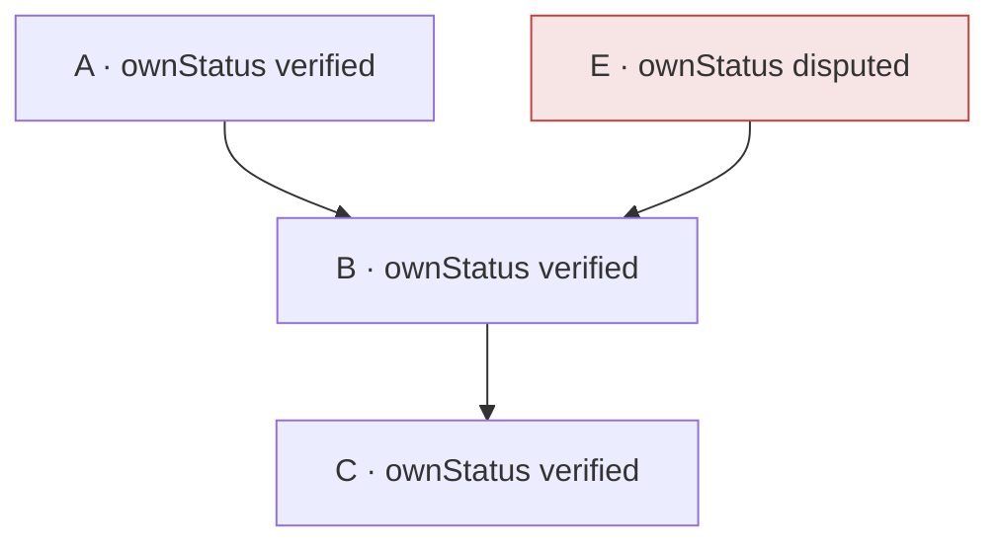

# Derivation and Counterfactual Algorithms

This page explains how Surface derives trust for claims that depend on other claims, and how it answers impact and drilldown questions over those dependencies. It is documentation-only. For the core vocabulary see [Concepts](../product/concepts.md); for the JSON contracts see [Schemas](../reference/schemas.md); for the normative single-claim status function see the Hachure spec referenced from [Conformance](../specs/conformance.md).

Three capabilities are covered, each with the property that makes it trustworthy:

- **The derivation ceiling** — how a derived claim's status is bounded by the inputs it depends on.
- **Claim evaluation** — the single evidence/policy assessment that keeps a claim's status and its transparency gaps in agreement.
- **Counterfactual traversal** — forward impact ("if this input flips, which conclusions move?") and reverse drilldown ("what does this conclusion depend on?"), with a soundness argument.

## Why derived trust needs bounding

Producers emit claims; some claims are *derived* from others (a rollup, a rule application, a model output). A derived claim is only as trustworthy as the claims it rests on. If an input is stale, disputed, or missing, a conclusion that depends on it cannot honestly present itself as `verified`. Surface enforces this with a **derivation ceiling**: derivation can only ever *weaken* a claim's status toward the truth of its inputs, never strengthen it.

This is a deliberately conservative, monotone rule. It means a consumer can trust that a `verified` conclusion has no weaker input hiding beneath it, and it makes the whole model provably well-behaved (below).

## The status strength order

Statuses are totally ordered by strength (`src/status-taxonomy.ts`). From strongest to weakest:

```
verified > proposed > assumed > unknown > stale > superseded > disputed > rejected > revoked
```

Two helpers operate on this order:

- `compareStatusStrength(a, b)` — numeric comparison.
- `weakerStatus(a, b)` — returns whichever of `a`, `b` is weaker. This is exactly the **minimum** over the strength order.

`weakerStatus` is the single primitive the entire derivation model is built on. Because it is a `min`, it is **associative, commutative, and idempotent** — the algebraic facts that make the algorithms below both simple and provably correct.

## The derivation ceiling

`applyDerivation` (`src/derivation.ts`) computes a derived claim's final status:

```
finalStatus(x) = weakerStatus( ownStatus(x), ceiling(x) )
```

where `ownStatus(x)` is the status the claim earns from its own evidence and events (see [claim evaluation](#claim-evaluation-one-assessment-status-and-gaps-agree)), and `ceiling(x)` is the weakest `ownStatus` across **every claim reachable from `x` through `derivedFrom` and `derivationEdges`**, walked transitively:

```
ceiling(x) = min over all transitive inputs i of ownStatus(i)
```

The walk uses a shared `visited` set, so each ancestor is folded once and cycles terminate. Both a cycle and a missing input attach an `unsupported_inference` transparency gap and a `blocked` change record (with reason `derivation-cycle` and `input-missing` respectively); a missing input also contributes `unknown` to the ceiling. The status *value* is still well-defined because `min` is idempotent — revisiting an already-folded input cannot change the ceiling.

An equivalent, more useful way to state the same thing is the **recursive identity**:

```
finalStatus(x) = weakerStatus( ownStatus(x), min over direct inputs y of finalStatus(y) )
```

This holds precisely because `min` is associative and idempotent: bounding by the direct inputs' *final* statuses (each of which already folded its own subtree) yields the same value as flattening the whole ancestor set. This identity is what makes counterfactual traversal exact.



In this graph, `B` derives from `A` and `E`; `C` derives from `B`. Because `E` is `disputed`, `ceiling(B)` is `disputed`, so `finalStatus(B) = disputed`, and that propagates: `finalStatus(C) = disputed`. Neither `B` nor `C` can present as `verified` while a disputed claim sits under them.

## Claim evaluation: one assessment, status and gaps agree

A claim's `ownStatus` and its transparency gaps both depend on the same underlying question: *does the collected evidence satisfy the verification policy?* Historically that question was answered twice — once by the status derivation and once by the gap derivation — which risked the two drifting out of agreement (a claim marked `proposed` for an unmet requirement, but with no gap explaining why, or vice versa).

`evaluateClaimEvidence` (`src/claim-evaluation.ts`) computes that assessment **once** — the entailing evidence, the missing required evidence types and methods, and whether corroboration is satisfied — and both the status decision and the gap emission read from it. The result is an invariant Surface can guarantee by construction:

> A claim derived `verified` never carries an unmet-requirement gap, and a claim held back to `proposed` for an unmet requirement always carries the gap that explains it.

Status and the gaps that justify it are now two projections of a single evaluation, so they cannot contradict each other. This is verified end-to-end in the test suite over the example bundle.

## Counterfactual traversal

Reviewers ask two dual questions about a dependency graph:

- **Reverse drilldown** — *from a conclusion, what does it depend on?*
- **Forward impact** — *from an input, what conclusions would be affected if it flips, stales, or becomes disputed?*

`src/counterfactual.ts` answers both.

### Reachability queries

- `traceDependencies(report, claimId)` — the transitive inputs a conclusion depends on, each with its shortest derivation distance. For the full annotated input tree (edges, evidence context, diagnostics) use `buildDerivationDrilldown`.
- `traceDependents(report, inputClaimId)` — the transitive conclusions that depend on an input, each with its shortest distance.

Both are breadth-first walks with a `seen` set, so they are cycle-safe, duplicate-free, report shortest-path depth, and return a deterministic order (depth, then claim id). A claim id unknown to the graph — neither a claim nor referenced as any claim's input — is rejected with an error rather than silently returning an empty result, so a mistyped id can never read as a falsely reassuring "no impact." (A dangling input reference is still a valid forward-traversal origin.)

### The counterfactual: `analyzeCounterfactual`

`analyzeCounterfactual(report, targetClaimId, hypotheticalStatus)` answers: *if `target` took `hypotheticalStatus`, which conclusions change, and to what?* It sets the target to the hypothetical status and recomputes the ceiling for every forward-reachable conclusion by **fixpoint relaxation**:

```
projected(x) = weakerStatus( baseline(x), min over direct inputs of projected(input) )
```

iterated until nothing changes. `baseline(x)` is the claim's already-derived status from the report. It reports each reachable conclusion whose projected status differs from its baseline, with before/after status and depth.

### Why it is sound

Two properties make this exact and safe, not merely a heuristic:

**1. Using the report's derived status as the floor is exact — not an approximation.** The recursive identity above says `finalStatus(x) = weakerStatus(ownStatus(x), min over inputs y of finalStatus(y))`. The report exposes `baseline(x) = finalStatus(x)` but not `ownStatus(x)`. Substituting `baseline` for `ownStatus` is nonetheless exact, because `weakerStatus` only ever lowers a value: `projected(y) <= baseline(y)` always holds, so in the expansion

```
projected(x) = min( ownStatus(x), min_y baseline(y), min_y projected(y) )
```

the `min_y baseline(y)` term is redundant — it is dominated by `min_y projected(y)` — and the expression collapses to `min(ownStatus(x), min_y projected(y))`, which is the true new final status under the hypothetical. The `min`-semiring structure of `weakerStatus` is exactly what makes the substitution lossless.

**2. It always terminates.** Each claim's projected status is a monotone-decreasing composition of `min`s over a finite, totally ordered set of nine statuses. So each claim's value can change at most eight times before it stabilizes; the relaxation cannot oscillate and must converge. It is cycle-safe for the same reason — a cycle simply relaxes to its fixed point.

Because derivation only bounds *downward*, a *strengthening* hypothetical produces no modelled change: the report does not expose headroom above a claim's own status, and derivation can never raise a conclusion above it. This is a faithful reflection of the model, not a limitation of the traversal — worsening an input is the case that matters for trust.

### Why it is useful

- **Blast-radius before you act.** Before disputing, revoking, or letting a claim go stale, a reviewer can see exactly which conclusions would be dragged down and by how much — turning "what depends on this?" from tribal knowledge into a query.
- **Explainable conclusions.** Reverse drilldown lets any derived `verified` (or `disputed`) claim be traced back to the source evidence and the specific input responsible.
- **Consume-never-fork.** Both directions are pure read models over an existing `TrustReport`. Producers emit the bundle; Surface answers the impact questions without re-deriving or mutating state.

## Recompute change records

Surface derives trust *statelessly* — every `buildTrustReport` re-runs the derivation from scratch — so "re-run a derivation method when inputs change" is a **diff between two derivations**, not a live re-execution. `recomputeChangeRecords(prior, next)` (`src/recompute.ts`) compares a prior report against a newer one and emits a before/after record for each derived claim whose direct inputs changed: which inputs moved (status and/or value), and how the derived claim's own status and value moved. An *unchanged recompute* — inputs moved but the derived result did not — is still reported (flagged unchanged), so a consumer can tell "recomputed, no effect" apart from "not recomputed". The cascade across depths is captured directly: in an `A → B → C` chain where `A` flips, `B`'s record cites the `A` change and `C`'s cites the `B` change.

**This lives in Surface core.** The recompute diff is a pure function of two reports — no state, no file watcher, no background process — so it belongs beside `diffFreshness` and the derivation kernel. A separate `@kontourai/surface-derive` package is only warranted for the genuinely heavier runtime this anticipated: a **stateful watcher** that observes producer inputs and triggers re-derivation, and an **arithmetic method executor** that recomputes a derived *value* from its inputs (e.g. actually summing input values for a `method: "sum"` edge). Neither is needed here — derived values are producer-owned, and Surface reports value *changes* by diffing the two reports rather than executing the method. That heavier runtime is deferred until a concrete consume-side need appears; the stateless core diff is the foundation it would build on.

## Derivation edge sensitivity

A `derivationEdge` may carry an optional `sensitivity` range (`DerivationEdgeSensitivity`: `{ low, high, basis }`) describing how much a derived value would move if that input moved — the quantitative companion to the qualitative status ceiling. Surface carries and validates the range as portable, domain-neutral metadata; producers own how they calibrate it. See [Schemas](../reference/schemas.md) for the field shape.

## Where this lives

| Capability | Module | Public entry points |
|---|---|---|
| Derivation ceiling | `src/derivation.ts` | `applyDerivation`, `derivationInputIds` |
| Claim evaluation | `src/claim-evaluation.ts` | `evaluateClaimEvidence` |
| Reverse drilldown (tree) | `src/derivation-drilldown.ts` | `buildDerivationDrilldown` |
| Counterfactual traversal | `src/counterfactual.ts` | `traceDependents`, `traceDependencies`, `analyzeCounterfactual` |
| Recompute change records | `src/recompute.ts` | `recomputeChangeRecords` |
| Status order | `src/status-taxonomy.ts` | `weakerStatus`, `compareStatusStrength` |

For the data shapes these produce, see the Trust Report section of [Schemas](../reference/schemas.md) and the `derivation` field in the [CLI reference](../reference/cli.md). For where derivation sits in the overall flow, see [Developer Architecture](developer-architecture.md).
