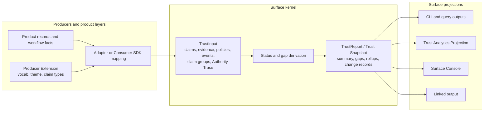
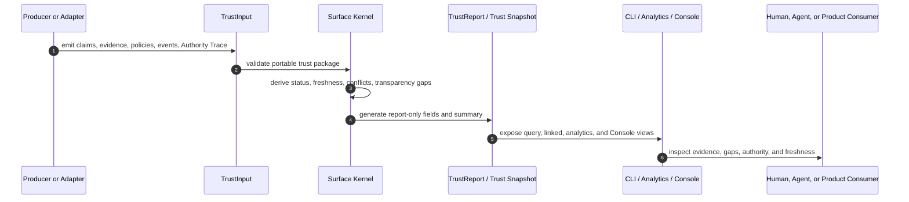
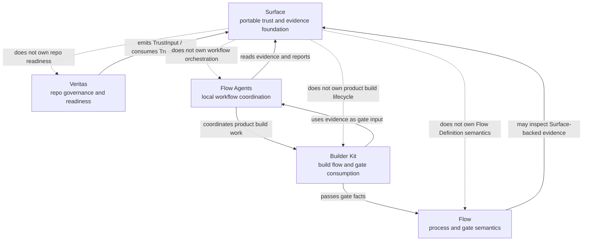

# Developer Architecture

This guide is the Surface-local map for maintainers and integrators who need to understand how trust and evidence move through Surface and into products built on top of it. It is documentation-only: it does not migrate schemas, change claim evaluation, add runtime dependencies, or implement Flow, Flow Agents, Veritas, or Builder Kit behavior.

Start here when you need the architecture in Surface vocabulary first. For the core vocabulary, see [Concepts](../product/concepts.md). For current JSON contracts, see [Schemas](../reference/schemas.md) and [Open Trust Format and Claim Package Shape](../specs/open-trust-format.md). For product-layer boundaries, see [Architecture](index.md), [Surface Foundation Boundary](surface-foundation.md), and [What builds on Surface](../product/built-on-surface.md).

## Scope And Non-Goals

**Current implementation:** Surface owns portable claims, evidence, verification policies, verification events, Authority Trace, trust derivation, Trust Reports, Trust Snapshots, analytics projections, and the Surface Console projection. Producers emit `TrustInput`; Surface validates and derives report-only trust state.

**Future Resource Contract alignment:** future slices may wrap durable Surface packages, reports, run models, claim stores, or extension records in `surface.kontourai.io/v1alpha1` Resource Contract shapes. That direction is tracked on the [Roadmap](../roadmap/index.md). This guide does not implement those migrations.

Non-goals for this guide:

- changing `TrustInput`, `TrustReport`, or schema behavior
- changing status derivation, transparency gap generation, or claim evaluation
- moving Veritas, Flow, Flow Agents, or Builder Kit workflow semantics into Surface
- replacing the existing schema, CLI, Console, or Open Trust Format references

## Current Surface Layers

Surface is a product-neutral trust foundation. Producers bring product-specific facts and evidence; Surface turns those into inspectable trust state.

**Current implementation:** this flow is available locally through the TypeScript API and CLI. `TrustInput` is the current claim package input contract, and `TrustReport` is the current derived report contract.

**Future Resource Contract alignment:** Resource wrappers can give durable packages and generated outputs stable `apiVersion`, `kind`, `metadata`, `spec`, `status`, and `status.conditions[]` fields. The native claim/evidence graph remains the portable content inside those records.

## Trust And Evidence Lifecycle

The lifecycle is intentionally local-first and producer-neutral. Surface does not collect evidence or decide product workflow gates. It preserves evidence, derives portable status, and exposes the result for humans, agents, and downstream systems.

**Current implementation:** Surface derives trust state from the current package. Claims remain inspectable with their evidence, policies, events, Authority Trace records, transparency gaps, and derivation change records.

**Future Resource Contract alignment:** a future generated report resource can place observed trust state in `status` and summarize key states as conditions such as `Generated`, `EvidenceComplete`, `ConflictsPresent`, `AuthorityTracePresent`, or `DerivationBlocked`.

## Cross-Product Ownership Boundaries

| System | Owns | Consumes from Surface | Does not own |
| --- | --- | --- | --- |
| Surface | Portable claims, evidence, policies, events, Authority Trace, status derivation, Trust Reports, Trust Snapshots, analytics, linked output, and Surface Console projection | Producer-emitted `TrustInput` and extension metadata | Product workflow enforcement, repo governance semantics, Flow gates, or Builder Kit lifecycle |
| Veritas | Repo governance, repo standards, readiness semantics, evidence checks, exceptions, and repo-local run artifacts | Surface trust state for portable evidence projection and inspection | Surface trust derivation or generic transparency gap semantics |
| Flow | Flow Definition steps, transitions, gates, and process semantics | Surface or Veritas evidence as gate input when integrations choose to use it | Surface claim evaluation or producer evidence collection |
| Flow Agents | Local agent workflow coordination, planning, verification, release, learning, and Builder Kit orchestration | Surface reports or Veritas readiness evidence for workflow evidence | Surface schemas, trust derivation, or product truth semantics |
| Builder Kit | Product build flow and gate consumption for shaped work | Surface/Veritas evidence that helps evaluate a build gate | Surface runtime behavior, Veritas readiness rules, or Flow Definition ownership |

The boundary rule is one-way: product layers may depend on Surface contracts and tooling, but Surface must not depend on product-layer runtime code. Product-specific terms become portable only when they are mapped to claims, evidence, policies, events, Authority Trace, and generated report fields.

**Current implementation:** Veritas is the concrete Kontour product built with Surface today. Other products can emit the same portable claim package shape without adopting Veritas terms.

**Future Resource Contract alignment:** Flow Agents and Builder Kit may consume Resource-shaped Surface records after future migration slices. That does not move their workflow semantics into Surface.

## Source Module Map

The current source layout is intentionally small and layer-oriented. Keep the public API stable through `src/index.ts`; prefer documentation and tests over broad source moves unless a module becomes hard to change through its current interface.

| Area | Current files | Purpose | Split only when |
| --- | --- | --- | --- |
| Public entry | `src/index.ts`, `bin/surface.mjs`, package `exports` and `bin` | Defines the package and CLI surface callers depend on | A new public subpath is deliberately designed and versioned |
| Kernel contracts | `src/types.ts`, `src/validate.ts`, `schemas/` | Owns portable claims, evidence, policies, events, and schema validation | Schema evolution creates independent validation paths with separate tests |
| Trust derivation | `src/status.ts`, `src/derivation.ts`, `src/trust-snapshot.ts`, `src/report.ts`, `src/trace-analysis.ts`, `src/claim-groups.ts`, `src/evidence-support.ts`, `src/identity.ts`, `src/policy-resolver.ts` | Derives status, freshness, conflicts, Transparency Gaps, identity rollups, Claim Group rollups, Trust Snapshots, and reports | A smaller interface can hide repeated traversal or policy logic from callers |
| Projections | `src/analytics.ts`, `src/linked.ts`, `src/derivation-drilldown.ts` | Projects derived trust state for analytics, linked output, and claim drilldown | Multiple projections duplicate the same traversal or formatting rules |
| Builder and stores | `src/consumer-sdk.ts`, `src/claim-authoring.ts`, `src/store.ts`, `src/policy-helpers.ts`, `src/attestation.ts` | Helps Builders author claim packages, evidence, attestations, and local claim stores | Store persistence or claim authoring gains another durable adapter |
| Extension and adapters | `src/extension.ts`, `src/adapter.ts`, `src/adapters/` | Registers producer vocabulary, claim types, and explicit adapter mappings | Two or more concrete adapters need shared lifecycle or configuration |
| CLI | `src/cli.ts`, `src/commands/` | Exposes local report, query, claim-store, and Surface Console commands | Command parsing or output formatting needs a smaller tested interface |
| Surface Console | `src/console/` | Runs the local Operator Console and serves its projection, HTML, CSS, and client script. Shared Console Kit assets may provide presentation consistency, but Surface owns Console behavior and trust semantics. | Console assets need independent build tooling or repeated Surface-owned UI modules emerge |

The largest files today are Console assets, `validate.ts`, and `types.ts`. Their size alone is not a reason to move folders: split them when the new module would give maintainers locality or hide meaningful implementation complexity behind a smaller interface.

## Local Reading Path

Use this order when you need to understand Surface without starting in cross-product docs:

1. [Concepts](../product/concepts.md) for claim, evidence, Authority Trace, Trust Snapshot, Transparency Gap, and Surface Console language.
2. [Open Trust Format](../specs/open-trust-format.md) for the portable claim package commitment.
3. [Schemas](../reference/schemas.md) for current `TrustInput`, `TrustReport`, and record shapes.
4. [Surface Foundation Boundary](surface-foundation.md) for what belongs in Surface versus product layers.
5. [Roadmap](../roadmap/index.md) only when planning future Resource Contract migration work.

If a statement says **Current implementation**, it describes behavior or artifacts that exist now. If it says **Future Resource Contract alignment**, it describes planned migration direction that needs its own implementation and verification.
