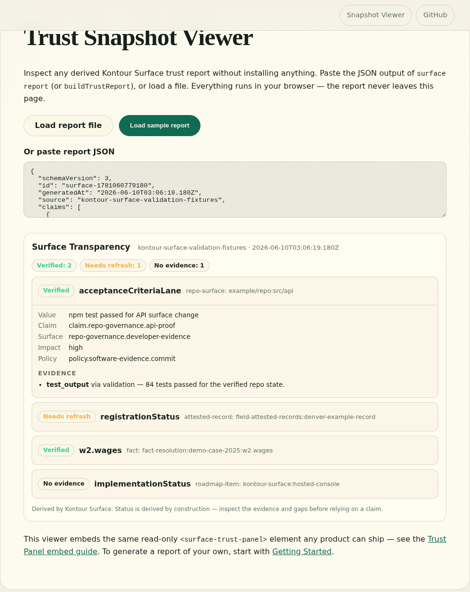

# Kontour Surface

Every product makes claims. AI makes those claims faster, more polished, and harder to review. Kontour Surface gives a product one shape for the claim, the evidence behind it, how fresh that evidence is, and the gaps that should slow anyone down before they rely on it.

Veritas uses Surface underneath. So can your product.

## The problem

AI makes plausible, polished product output cheap. When agents route records, select facts, merge changes, or draft responses at scale, the informal trust layer disappears. There is no one to notice a stale number, a quiet contradiction, unsupported evidence, or a verification that was valid last month but not today.

Trust state has to be derivable from the product contract itself: readable, deterministic, and the same answer for every person, system, or agent that asks.

## How Surface works

Surface connects evidence provenance to product claims through a portable, open trust format:

- **Subject** — what the claim is about, including when the same entity appears under different keys across systems
- **Evidence Trace** — what supports the claim, who or what produced it, and how to trace it back to a source
- **Freshness** — how long the verification is valid and what has changed since verification
- **Transparency Gaps** — what is missing, stale, private, disputed, unavailable, or unsupported
- **Trust Snapshot** — a point-in-time report that can drive a Trust Panel, the Surface Console, an API, or an agent resource

Status is derived by construction — not summarized by a model, not hidden behind a confidence score. If a claim is weak, stale, or disputed, the system makes that visible.

## Where teams use it

- **AI code governance** — reviewers and agents inspect which repo claims are actually supported by this run's evidence, and which went stale when the code changed.
- **Field-attested public records** — a directory shows, field by field, what was crawled, what a human attested, and what has not been re-approved since the price changed.
- **Fact resolution** — a financial workflow lets an agent proceed on user-verified facts while document-imported values that conflict with a worksheet stay visibly disputed.
- **Dependency audits** — "safe to install" becomes a claim with a freshness window and a trace to the exact audit run, not a sentence in release notes.

Each scenario ships as a runnable fixture in the repo. [See the full use cases.](product/use-cases.md)

## See it

The same fixture report, inspected three ways — in the browser-local [Snapshot Viewer](https://kontourai.github.io/surface/viewer.html), embedded in a product page, and in the operator Console:

## Four ways in

- **Inspect** — open the trust state behind an answer, report, or agent output before you rely on it. Paste any derived report into the [Snapshot Viewer](https://kontourai.github.io/surface/viewer.html) — it parses in your browser and never leaves the page — or ship the [Trust Panel embed](reference/trust-panel.md) inside your product.
- **Build** — emit claims, evidence, and policies from your product with the [TypeScript SDK](guides/consumer-sdk.md), then let Surface derive and serve the trust state to people, agents, and downstream systems.
- **Operate** — manage the claims your product makes — ownership, evidence review, policies, gaps, conflicts — in the [Surface Console](reference/console.md). It runs locally. No cloud, no login.
- **Automate** — point an agent at [`surface mcp`](reference/mcp.md) and it reads the same derived trust state over the Model Context Protocol: act on verified, reverify stale, escalate disputed.

## Start here

1. [Getting Started](guides/getting-started.md) — install `@kontourai/surface`, run a fixture report, emit your first trust input.
2. [Walkthrough](guides/walkthrough.md) — a real CLI session: derive a report, query stale claims, drill into a policy decision.
3. [Concepts](product/concepts.md) — the full vocabulary: claims, evidence traces, policies, claim groups, transparency gaps, status.
4. [Use Cases](product/use-cases.md) — when to reach for Surface, what builds on it, and what it deliberately does not do.

Surface is open source under Apache-2.0. The trust format is schema-first and locally inspectable — no hosted service required to understand your own trust state.
